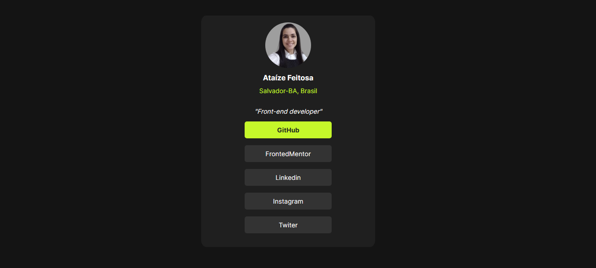
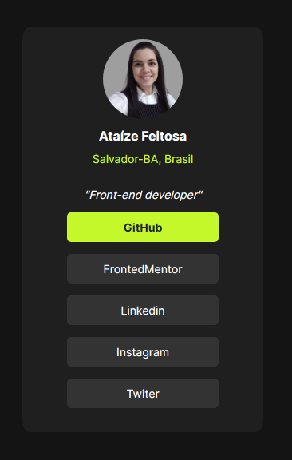

# Perfil de Links Sociais

Este é um projeto de perfil de links sociais desenvolvido como parte de um desafio do Frontend Mentor. O objetivo do desafio é construir um perfil de links sociais responsivo que atenda a certos critérios de design.

## Tecnologias Utilizadas

- HTML5
- CSS3

## Desafio

Os usuários devem ser capazes de:

- Ver estados de hover e focus para todos os elementos interativos na página

## Capturas de tela

Imagem no formato desktop:

Imagem no formato mobile:

## Desenvolvimento futuro

Nos próximos projetos pretendo usar sass e react.

## Contato

Se você tiver alguma dúvida ou sugestão, sinta-se à vontade para entrar em contato através do meu e-mail: ataizearagao@gmail.com
